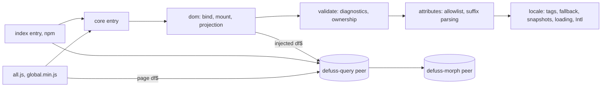

# Architecture: defuss-i18n

defuss-i18n turns HTML-authored locale variants into in-place updates of a live page. It owns locale state, template and attribute selection, value interpolation and the order of writes, and it hands every structural DOM update to defuss-morph through defuss-query. It is not a message-catalog runtime, translation service, ICU message parser, sanitizer, framework binding or DOM transaction, and it never guesses sibling locales or reconstructs native state.

## Why this design

- **Morph, not markup replacement.** Replacing a region's markup destroys its elements and their state. Patching matched nodes keeps identity, listeners, an open modal dialog, focus, the selection range and typed or checked input; the browser suite checks each of these in all four shipped builds.
- **Explicit regions with one owner per node.** `data-i18n-target` marks what the library may rewrite. Overlapping targets, child components inside a region and templates inside their own target are rejected at bind time, because each would give a node two owners.
- **Templates beside the default HTML.** A region's whole localized fragment can change structure, not only strings, and the default markup renders without JavaScript. Inert `<template>` content is parsed but not rendered.
- **Synchronous, phased projection.** When `setLocale` returns, every bound component shows the new locale. Bindings render in a `render` phase before ordinary `notify` subscribers, and subscriber failures are collected into one `AggregateError` after everyone has run; core tests cover both.
- **Isolated controllers and side-effect-free imports.** A page can hold several locales at once. The packed-consumer test imports the npm entries with `document` and `df$` access trapped.
- **Native `Intl` instead of bundled CLDR data.** The minified browser ESM is 16,242 bytes (6,201 gzip) with the peers external (`dist/stats.json`).

[documentation/design.md](documentation/design.md) gives the longer rationale for each choice, including the reasoned (not measured) ones.

## How it works

Arrows point from a module to what it depends on:

| Module | Owns | Depends on |
| --- | --- | --- |
| locale | canonical tags, fallback, immutable revisions, phase ordering, async tickets, `Intl` | ECMAScript platform |
| attributes | content-attribute allowlist and locale suffix parsing | locale |
| validate | authoring diagnostics and ownership boundaries | locale, attributes |
| dom | ownership, source capture, plan preparation, query writes, lifecycle | validate, injected `df$` |
| core | side-effect-free exports and injection | internal modules |
| index | npm convenience binding | core, defuss-query peer |
| all | explicit browser installation at `df$.i18n` | core, the page's `df$` |

There is one reconciler, defuss-morph. Live content and attribute writes go through defuss-query; native DOM APIs only inspect markup, clone sources and build detached preparation containers. There is no second diff algorithm, virtual DOM, reactive store, global locale or MutationObserver.

**Projection.** `setLocale` commits a canonical, immutable snapshot. Each binding then reads application state once, selects a template per region through the fallback chain and native plural rules, prepares literal values and localized attributes on detached clones, checks every plan, morphs its regions, writes shell attributes and `lang`/`dir`, runs `afterRender` and dispatches `defuss-i18n:change`. Ordinary subscribers run after all bindings. Preparation precedes live writes within one binding; across bindings there is no rollback, and user callbacks or peer lifecycle hooks can observe intermediate states.

**Ownership and loading.** Shells keep native state; regions own their complete descendant markup. Templates are captured at `bind`/`rescan` and never moved. Nested templates are rejected because the peers do not carry template content through a morph. `loadLocale` stages data in a loader and lets only the newest request ticket commit and publish; every synchronous change, even a no-op, invalidates pending tickets. Disposal is explicit; roots are tracked in a `WeakMap`, and nothing detects unmounts or pierces shadow roots. SVG/MathML handling, event delegation and shadow-root targeting follow the peers' own rules.

**Contracts.** Consumers rely on the `defuss-i18n`, `defuss-i18n/core` and `defuss-i18n/global` entries, the HTML attributes and the error and diagnostic texts listed in [the API reference](documentation/api.md) and [errors](documentation/errors.md); `tests/docs.test.mjs` fails when an export, code or message is undocumented.

## Operations

- **Configuration and policy:** no runtime configuration beyond the options of each controller and binding, which are validated when used (invalid tags raise `RangeError`, a direction policy returning anything but `ltr`/`rtl` raises `TypeError`). Development settings live in `.env.example`.
- **Deployment and scaling:** the project site in `docs/` is served by GitHub Pages from `main` at <https://i18n.defuss.org> (`docs/CNAME`, HTTPS enforced). The library is released to npm with `bun publish`, whose `prepublishOnly` runs `bun run check`. pkgroll builds `dist/index` and `dist/core` as ESM and CommonJS with `.d.ts`/`.d.cts`; esbuild builds `dist/all.js`, `dist/all.min.js` and the classic-script `dist/global.min.js` with source maps; `scripts/verify.mjs` checks source freshness, size budgets, maps and that no peer engine is bundled.
- **Complexity and resources:** a binding's render walks the component's owned elements and clones the selected template for each region, so its cost grows with component size, and all bindings render synchronously inside `setLocale`. `formatNumber`, `formatDate` and `plural` construct a new `Intl` object on each call; code formatting in a tight loop should keep its own `Intl` instance.
- **Third-party integrations:** defuss-query (peer `^0.1.0`) and defuss-morph (peer `^0.1.1`) stay external and are tested at 0.1.0 and 0.1.1. `createDomI18n` throws when the runtime lacks `morph`, and the browser builds throw when `df$` is missing. The project site in `docs/` is built by `scripts/build-site.mjs` from `site/page.html` and `site/translations.json`, which writes each English sentence as both the visible default and the `en` template; it loads defuss-shadcn 0.9.8 and defuss-i18n 0.1.0 from jsDelivr with Subresource Integrity; `scripts/verify.mjs` rejects local, unpinned or integrity-free runtime URLs there, and the browser test runs the site once as published and once with this checkout's `dist/all.min.js` in place of the CDN file, then in a German browser, without JavaScript and at phone width.
- **Reliability:** failures are explicit and fail closed per binding: a missing template, value or variant throws before that binding writes. Locale changes stay committed when subscribers fail; reentrant changes and refreshes are rejected; superseded loads resolve as `superseded` and never commit.
- **Observability:** the library logs nothing and emits no metrics. Every thrown message starts with `defuss-i18n:` and is listed in [errors](documentation/errors.md); each binding dispatches `defuss-i18n:change` after its writes; `validateI18n` returns structured diagnostics.

## Security and privacy

Template markup, HTML loaded in a `loadLocale` commit, renderer output and URL-valued attribute translations are trusted markup: they become live DOM and are not sanitized, so editable sources must be sanitized before they reach the page. Interpolation values may be untrusted: only strings, numbers and booleans are accepted, they are written as text, and slots on raw-text elements (`script`, `style`, `iframe` and similar) are rejected before any write; the browser suite runs injection payloads in every shipped build. The [security model](documentation/security.md) lists each boundary.

The library makes no network requests and uses no storage, cookies, timers or logging (no such API appears in `src/`); a locale loader fetches only what the application's loader code fetches. It collects, stores and transmits no personal data. The project site is different: it requests its scripts and styles from cdn.jsdelivr.net, which receives the visitor's IP address and user agent. Values the application passes in stay in memory, and a binding keeps its last render context until it is disposed; any personal data in those values is processed under the application's own legal basis and retention.
