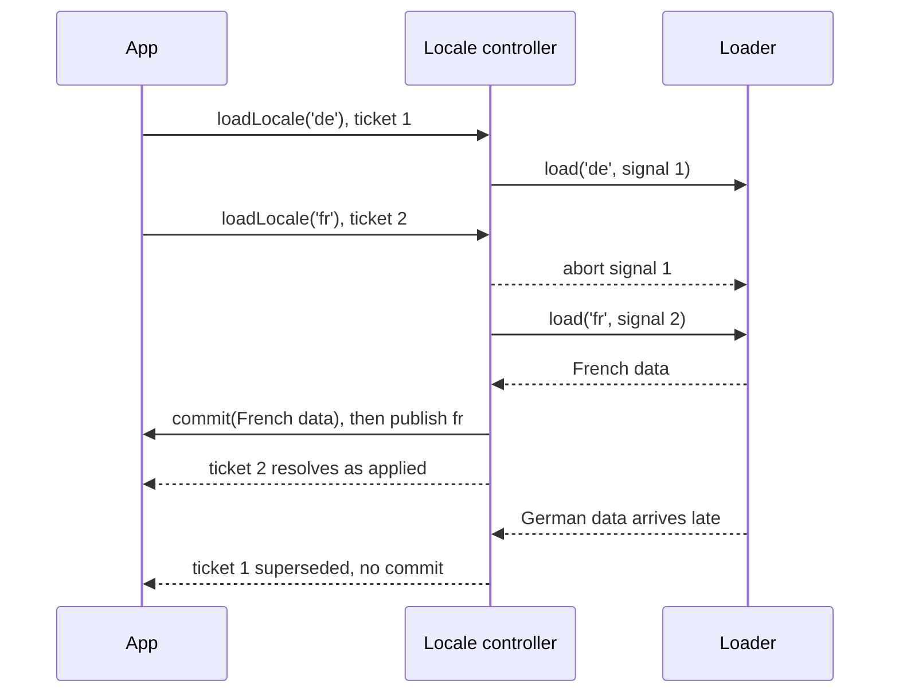

# Lazy loading locales

To keep the first page small, ship the default locale in the HTML and fetch the others when the user picks them. `locale.loadLocale(tag, loader, commit)` makes this safe when requests race: only the newest request's commit runs and publishes.

## The contract

```js
const result = await locale.loadLocale(tag, loader, commit);
// result.status: 'applied' | 'superseded'
```

1. **`loader(canonicalTag, signal)`** is async. It fetches and parses, and **must not change the page**. If a newer request starts before this one finishes, this request's result is discarded.
2. **`commit(data)`** is synchronous. It runs only when this request is still the newest one. Here you add the new templates to the DOM and call `binding.rescan()`.
3. Then the locale is published, forced even if it equals the current locale, and every binding renders.

When a user picks German and then French before the German data arrives, only the French request commits:



Starting another `loadLocale`, calling `setLocale` (even with the current locale), calling `locale.refresh()` or disposing the controller cancels the pending request. Its signal aborts, its result is ignored, and it resolves to `{ status: 'superseded' }`. The abort signal is advisory: a loader that ignores it is still safe, because its data is never committed.

## Example: one HTML fragment per component and locale

`/i18n/de/welcome.html` holds just the templates:

```html
<template data-i18n-for="intro" data-i18n-locale="de"><h2 key="heading">Willkommen</h2><p key="lead">Schön, dass du da bist.</p></template>
```

```js
import { createI18n, bindI18n } from 'defuss-i18n';

const locale = createI18n({ locale: 'en' });
const components = ['welcome', 'cart'].map(id => bindI18n(document.getElementById(id), locale));
const loaded = new Set(['en']);

// Parse into a detached fragment: no live DOM changes in the loader.
const parseSources = html => {
  const holder = document.createElement('template');
  holder.innerHTML = html;
  return holder.content;
};

export async function switchLocale(tag) {
  if (loaded.has(tag)) { locale.setLocale(tag); return; }
  const result = await locale.loadLocale(
    tag,
    (canonical, signal) => Promise.all(components.map(async binding => {
      const response = await fetch(`/i18n/${canonical}/${binding.root.id}.html`, { signal });
      if (!response.ok) throw new Error(`${response.status} ${response.url}`);
      return parseSources(await response.text());
    })),
    fragments => {
      fragments.forEach((fragment, index) => {
        components[index].root.append(fragment); // templates go outside the targets
        components[index].rescan();              // adopt them before the locale publishes
      });
      loaded.add(tag);
    },
  );
  return result.status; // 'superseded' when the user clicked another language meanwhile
}
```

Wrap the call in `try/catch` to show an error state. The newest request's loader or commit failure is rethrown and the locale stays unchanged. Failures of superseded requests are swallowed.

## Pitfalls

- **Insert templates with native DOM.** Appending a template *string* through `df$(...).append('<template>…</template>')` produces an empty template, because the query/morph path does not carry over inert template content. Parse with a `<template>` holder as above and append the resulting nodes.
- **Call `rescan()` in the commit, not after `await`.** The commit runs before the locale is published. If you add templates after `loadLocale` resolves, the publish render still uses the old sources and quietly falls back: `de` renders English with `lang="en"` on the region.
- **`rescan()` in the commit renders once more in the *old* locale.** Each component re-renders immediately, and a `defuss-i18n:change` event fires for the old locale, then again for the new one. Make listeners idempotent.
- **Don't add the same locale twice.** A second template for the same target, locale and plural category makes `rescan()` throw `DUPLICATE_VARIANT`. Because that throw happens inside the commit, the load rejects and the locale stays unchanged. Track what you loaded, as with `loaded` above.
- **Loaded templates are trusted HTML.** They become live markup. Serve them from your own origin, or sanitize translator- or CMS-provided HTML before it reaches the commit (see [security](security.md)).
- **Read state late.** Bindings call `getState()` during the publish render, after the `await`, so they always render the newest application state. Don't capture state in the loader.

## Reloading the current locale

`loadLocale` with the current tag still applies and forces a render. Use it to swap in corrected copy for the active locale (for example after a CMS update). Remove the outdated templates in the commit before appending the new ones, or `rescan()` will report duplicates.

## Non-HTML data

`loadLocale` doesn't care what the loader returns. Use it for any locale-dependent data that has to switch atomically with the page, such as a JSON price list:

```js
let prices = {};
await locale.loadLocale('de',
  async (tag, signal) => (await fetch(`/prices.${tag}.json`, { signal })).json(),
  data => { prices = data; });   // bindings read `prices` through getState during the publish render
```
