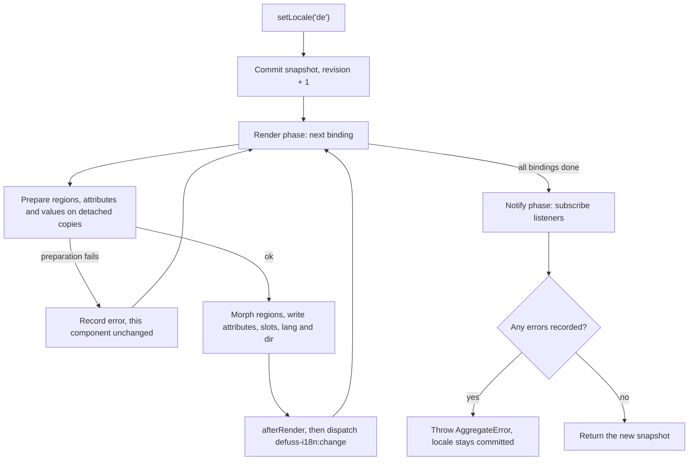

# State and ownership

A locale switch rewrites markup, and the user's state lives in that markup: the open dialog, the half-typed input, the focused button. To protect that state, defuss-i18n gives every part of a component one owner and writes **only what it owns**: whole regions, plus the attributes, slots and `lang`/`dir` you declared elsewhere.

## Roots, shells and regions

```html
<dialog id="settings" data-i18n-component>                 <!-- root: also the shell -->
  <h2 data-i18n-target="heading">Settings</h2>             <!-- region -->
  <template data-i18n-for="heading" data-i18n-locale="en">Settings</template>
  <template data-i18n-for="heading" data-i18n-locale="de">Einstellungen</template>
  <input id="nickname" placeholder="Your name"
         data-i18n-placeholder-en="Your name" data-i18n-placeholder-de="Dein Name">  <!-- shell element -->
</dialog>
```

| Part | Who writes it | What a switch changes |
| --- | --- | --- |
| **Root** (`data-i18n-component`) | You, plus the binding for `lang`, `dir` and declared attribute translations | only `lang`, `dir` and attributes declared with `data-i18n-{attr}-{locale}` |
| **Shell** (root descendants outside regions) | You | only declared attribute translations and `data-i18n-value` slot text |
| **Region** (`data-i18n-target`) | The binding | the whole subtree is morphed to the selected template |
| **Nested component** | Its own binding | nothing; the parent skips it |

Shell elements are never morphed, so native state on them survives: a modal `<dialog>` stays open and modal, and focus and selection stay where they were. The browser suite runs a test with an open modal dialog, focus and a text selection.

## What morphing preserves inside a region

The morph matches old and new children by `key`, then by `id`; an unkeyed child takes the first remaining old sibling with the same tag. A matched element is **kept and patched**, not replaced, so it keeps:

- its identity: references you hold stay valid
- event listeners added with `addEventListener`
- uncontrolled form state the new markup does not declare: typed `value`, `checked` state and focus

A region **owns every attribute** in its subtree. Classes, `data-*` attributes and other attributes your scripts add inside a region are removed on the next render, because the template doesn't declare them. Elements stay the same nodes, but those attributes are gone. Two ways out:

1. Move the imperative element out of the region into the shell, and translate its attributes there with `data-i18n-{attr}-{locale}`.
2. Use a [state renderer](#state-renderers) that re-declares that state on every render.

### Keys and stable tags

```html
<template data-i18n-for="body" data-i18n-locale="en"><h2 key="title">Cart</h2><button key="buy">Buy</button></template>
<template data-i18n-for="body" data-i18n-locale="ja"><button key="buy">購入</button><h2 key="title">カート</h2></template>
```

Give `key`s to siblings whose order or presence differs between locales, and to anything that holds state or listeners. Keep the same tag name for the same key or id in every locale. If the tag changes, the node is replaced and its state is lost, so `validateI18n` reports `IDENTITY_TAG_MISMATCH`. Keys only need to be unique among siblings.

## Rules for regions

The validator enforces these, and `bind` refuses to bind a component that breaks them:

- Targets are uniquely named within a component and **do not overlap**: no target inside another target.
- A target contains **no nested component**, and templates do not introduce components, targets or nested `<template>`s. Morphing does not carry nested template content over.
- Templates sit **outside** their own target, because the first render would delete them otherwise.
- `label for`, `aria-labelledby` and `aria-describedby` in a template must resolve either inside the template or to an element outside the live target.

## Nested components

```html
<section id="page" data-i18n-component>
  <h1 data-i18n-target="title">Shop</h1> …templates…
  <aside id="cart" data-i18n-component> … </aside>
</section>
```

The parent ignores everything inside `#cart`: its regions, attributes and slots. Bind both, in either order, or call `mount(page, locale)`, which binds every marked root in the scope including the scope itself. A child can't sit inside a parent's *region*, because the parent's morph would overwrite it (`NESTED_OWNERSHIP`).

## Choosing the update call

| You changed... | Call | Effect |
| --- | --- | --- |
| the locale | `locale.setLocale(tag)` | every bound component re-renders, synchronously |
| application state read by `getState`/`values` | `binding.refresh()` | re-render this component in the current locale |
| only the interpolation values | `binding.setValues(map)` | replace the value map and re-render |
| templates, or targets added/replaced | `binding.rescan()` | re-capture sources and targets, validate, re-render |
| everything for this locale (e.g. new data) | `locale.refresh()` | new revision, every component re-renders |

Templates are copied when you call `bind` or `rescan`, so editing them later does nothing until the next `rescan()`. A region element you replaced from outside fails the next render with `target was replaced; call binding.rescan()`.

`setValues` overrides `values` until the binding is disposed. If the re-render fails *before* touching the DOM, the previous map is restored. Once the DOM has been written, the new map stays committed even if a later `afterRender` throws.

## State renderers

Some components have no stable markup to translate: their whole content depends on application state. Bind them with a renderer. The renderer owns the root's entire content:

```js
let state = Object.freeze({ checked: true, name: 'Ada' });

const preferences = bindI18n(document.getElementById('preferences'), locale, {
  getState: () => state,
  values: state => ({ name: state.name }),
  render: ({ locale }) => `
    <label key="label"><input key="check" type="checkbox"> ${locale === 'de' ? 'Aktiv' : 'Enabled'}</label>
    <p key="greeting">${locale === 'de' ? 'Hallo' : 'Hello'} <span data-i18n-value="name"></span></p>`,
  afterRender: ({ root, query, state }) => query(root.querySelector('input')).prop('checked', state.checked),
});

state = Object.freeze({ ...state, checked: false });
preferences.refresh();
```

- `getState()` is called exactly once per render, right before projecting. That includes the render that follows a lazy load, so the renderer always sees state from after the `await`.
- `render` must return a string synchronously. The output is morphed in, so keyed nodes keep their identity.
- Put dynamic text into `data-i18n-value` slots instead of concatenating it into the HTML. Slots are filled as literal text (see [security](security.md)).
- Leaving an attribute out does **not** reset live state: the morph leaves unspecified uncontrolled state alone. Use `afterRender` with `query(...).prop(...)` to set properties such as `checked` or `value` explicitly.
- A renderer can't produce `data-i18n-component` or `<template>` elements, and a renderer root can't contain child components.

## Lifecycle

| Event | What happens |
| --- | --- |
| `bind(root, locale)` | marks the root with `data-i18n-component`, captures sources, validates, subscribes, renders immediately in the current locale |
| `bind` on an already-bound root | throws `component already bound`; reuse the existing binding or dispose it first |
| `binding.dispose()` | unsubscribes; the DOM stays as last rendered; the root can be bound again |
| `locale.dispose()` | every binding of that controller reports `disposed`; roots can be re-bound to another controller |
| root removed from the page | nothing happens automatically: dispose the binding when your app removes the component |

Bindings are registered in a `WeakMap` keyed by the root element. A removed root does not keep a binding alive. However, until you dispose it, the controller's subscriber list still holds its render function.

There is no MutationObserver. Components inserted later are bound explicitly. They render in the controller's current locale immediately, so a component mounted after a switch to German appears in German.

## Shadow DOM

The library never searches inside shadow roots. To localize inside one, bind a root element that lives in that shadow tree. ID references in templates resolve within the same shadow tree. Change events bubble but are not `composed`, so they stop at the shadow boundary. Use `eventTarget` to dispatch them somewhere else.

## Events and ordering

During `setLocale`, the locale commits first, every binding renders, and only then do ordinary subscribers run:



While bindings render, `locale.snapshot` already holds the new value. Errors thrown later in a binding (in `afterRender`) or by a subscriber are recorded the same way, and the `AggregateError` comes only after everyone has run.

Use a plain `locale.subscribe` listener for "the whole page is now in German". Use the per-component event when a single widget needs to react to its own update. Changing the locale from inside a listener is rejected. Schedule it with `queueMicrotask` instead.

Within one component, all preparation runs before any live write, so a missing template or bad value fails without changing the DOM. Writes across several components are not one transaction: if the third component fails, the first two have already switched.
